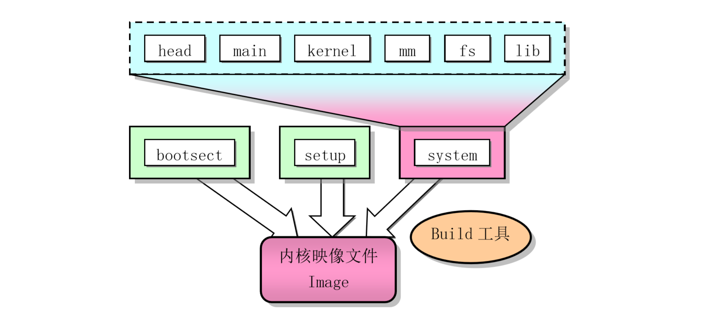

# linux0.12内核剖析 - 镜像构建

linux0.12内核源码在make之后，会生成三个主要的文件，分别为bootsect、setup、system。它们是如何组装到一起形成Image镜像的呢？

- 相关文件：`tools/build.c`

该`build.c`文件将被独立编译成一个可执行文件`build`，只参与将bootsect、setup、system三个文件组合成一个映像文件Imgae，不会被包含到Imgae中，因此可以拿出来单独分析。



该执行文件在主目录下的Makefile中被使用，通过以下以下命令生成映像文件Image。

```makefile
Image: boot/bootsect boot/setup tools/system tools/build
        tools/build boot/bootsect boot/setup tools/system $(ROOT_DEV) $(SWAP_DEV) > Image
        sync
```

## Image文件的结构

linux0.12内核映像结构（即生成的Image文件，`Image = bootsect(1) + setup(4) + system(...)`）如下所示：


组成Image的三个文件的说明(了解即可)：

1. bootsect = 32B的MINIX执行文件头结构 + 512B的代码和数据
2. setup = 32B的MINIX执行文件头结构 + 剩余部分的代码和数据
3. system = 1KB的a.out头结构 + 剩余部分的代码和数据

注意：所有头结构都是不需要的，需要去除掉。

## build 干了什么

build程序具体做了以下一些事（这里的扇区以1为第一个扇区）：

1. 校验bootsect头部并去除，将剩余的代码和数据写入Image中的第1个扇区，并读取根设备号和交换设备号写入Image中的第1个扇区的506、507、508、509字节处；
2. 校验setup头部并去除，将剩余的代码和数据写入Image中的第2~5个扇区，共四个扇区；
3. 校验system头部并去除，将剩余的代码和数据写入Image中的setup之后的扇区（…）。