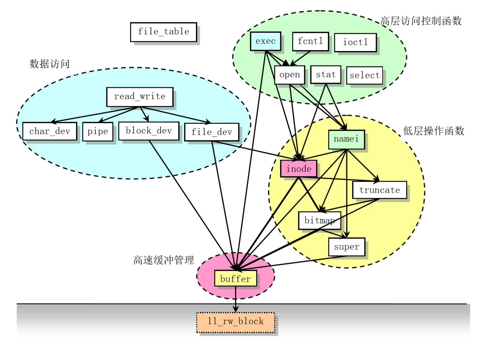

# linux0.12内核剖析 - 文件系统（二）

linux0.12文件系统的设计结构，简析fs目录下各文件的功能。

## 文件系统的系统调用

- 存取已存在文件：`open`、`read`、`write`、`lseek`、`close`
- 创建新文件：`creat`、`mkmod`
- 管理索引节点和文件系统：`chdir`、`chroot`、`chmod`、`stat`、`fstat`
- 管道相关：`pipe`、`dup`
- 挂载文件系统：`mount`、`umount`
- 修改文件层次：`link`、`unlink`

## 与文件系统相关的目录

- buffer.c 高速缓冲区的相关操作
    - `get_hash_table` 在高速缓冲区中寻找指定的缓冲块
    - `getblk` 取高速缓冲中指定的缓冲块
    - `brelse` 释放指定缓冲块
    - `bread`、`breada`、`bread_page` 从设备上读取指定数据块（一块、多块或一页）到高速缓冲区

- bitmap.c i节点位图和逻辑块位图的相关操作
    - `free_block` 释放设备dev上数据区中的block号逻辑块
    - `new_block` 向设备dev申请一个逻辑块
    - `free_inode` 释放指定的i节点
    - `new_inode` 在设备dev上创建一个新i节点
    
- super.c 超级块的相关操作
    - `get_super` 取指定设备dev的超级块结构体指针
    - `put_super` 释放指定设备dev的超级块
    - 系统调用: `umount`、`mount`

- truncate.c 文件截断
    - `truncate` 截断文件，即释放文件占用的空间

- inode.c 
    - `bmap` 取文件数据块block在设备上对应的逻辑块号
    - `iput` 放回一个i节点
    - `iget` 取得一个i节点

- namei.c
    - `_namei` 根据指定路径名寻找对应的i节点
    - 系统调用：`mknod`、`mkdir`、`rmdir`、`link`、`unlink`、`symlink`

- read_write.c 为不同文件类型的读写操作提供统一的接口
    - 系统调用：`read`、`write`、`lseek`

- open.c
    - 系统调用: `ustat`、`utime`、`access`、`chdir`、`chroot`、`chmod`、`chown`、`open`、`creat`、`close`

- fcntl.c
    - 系统调用：`dup`、`dup2`、`fcntl`

- select.c
    - 系统调用：`select`

- stat.c
    - 系统调用：`stat`、`lstat`、`fstat`、`readlink`

-ioctl.c
    - 系统调用：`ioctl`

- exec.c
    - 系统调用：`exec`簇