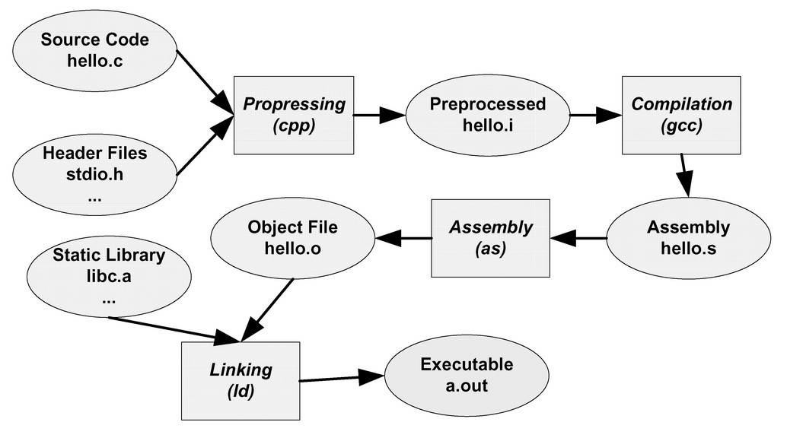
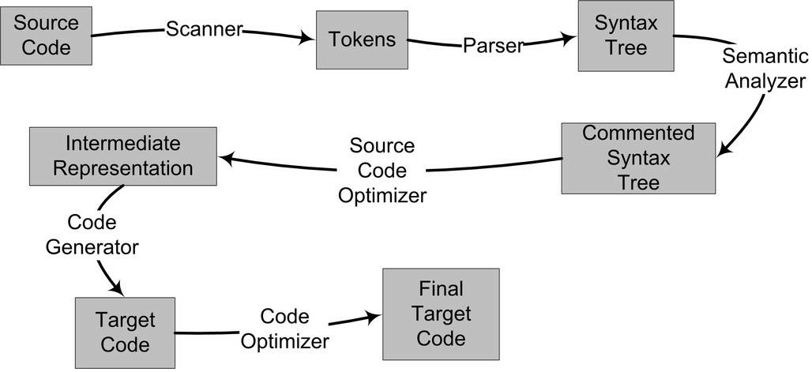
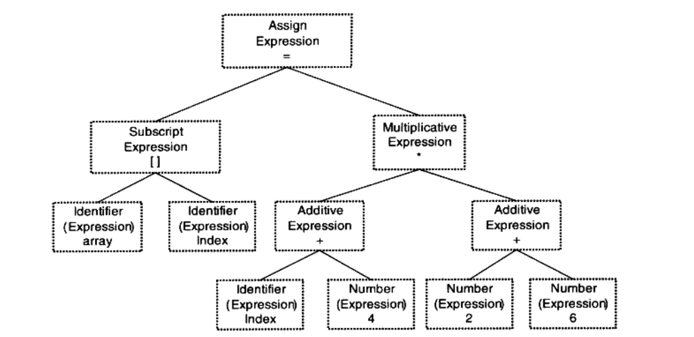
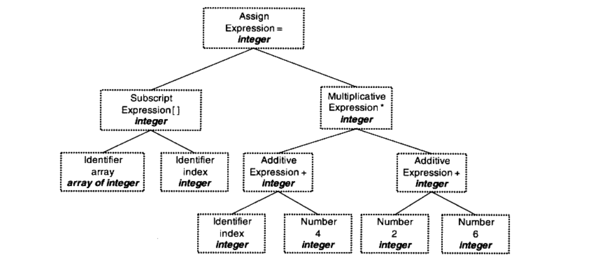
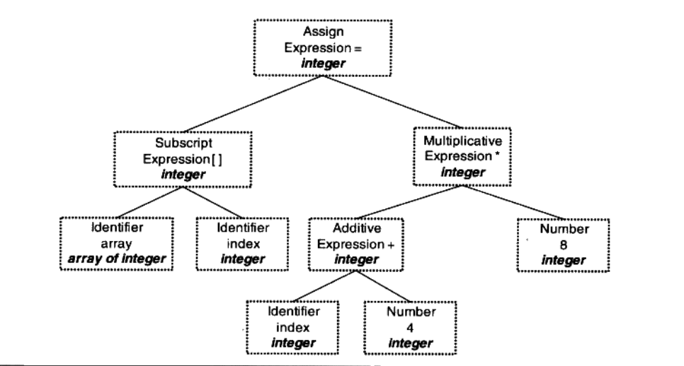
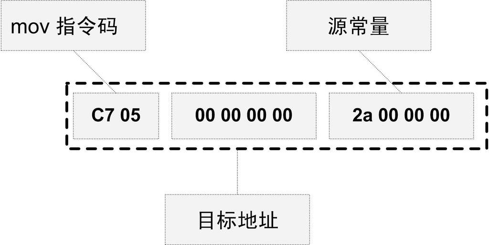

# C代码到C程序

耳熟能详的“Hello World”程序，基本上成了程序入门的必写程序。本文用Hello World程序探究被隐藏的编译过程。

<!--more-->

```c
#include <stdio.h>

int main()
{
    printf("Hello World\n");
    return 0;
}
```

对应这段代码而言，在windows的集成开发环境IDE下，我们可能只需要按下RUN或BUILD按钮，这段代码就被编译运行了。同样在Linux下，一个`gcc hello.c`命令就完成了所有工作。

事实上，上述过程可以分解为4个步骤，分别是**预处理（Prepressing）**、**编译（Compilation）**、**汇编（Assembly）**和**链接（Linking）**。



gcc这个命令只是这些后台程序的包装，它会根据不同的参数要求去调用预编译编译程序cc1、汇编器as、链接器ld。

## 1. 预编译

首先是`hello.c`和相关的头文件，如`stdio.h`等被预编译器cpp预编译成一个`.i`文件。对于C++程序来说，源代码文件的扩展名可能是`.cpp`或`.cxx`，头文件的扩展名可能是`.hpp`，而预编译后的文件扩展名是`.ii`。

```shell
gcc –E hello.c –o hello.i
# 或
cpp hello.c > hello.i
```

预编译过程主要处理那些源代码文件中的以`#`开始的预编译指令。

- 将所有的`#define`删除，并且展开所有的宏定义。

- 处理所有条件预编译指令，比如`#if`、`#ifdef`、`#elif`、`#else`、`#endif`。

- 处理`#include`预编译指令，将被包含的文件插入到该预编译指令的位置。注意，这个过程是递归进行的，也就是说被包含的文件可能还包含其他文件。

- 删除所有的注释`//`和`/* */`。

- 添加行号和文件名标识，比如`#2"hello.c"2`，以便于编译时编译器产生调试用的行号信息及用于编译时产生编译错误或警告时能够显示行号。

- 保留所有的`#pragma`编译器指令，因为编译器须要使用它们。

## 2. 编译

编译过程就是把预处理完的文件进行一系列**词法分析**、**语法分析**、**语义分析**及**优化**后生产相应的汇编代码文件，这个过程是整个程序构建的核心部分。

```shell
gcc –S hello.i –o hello.s
# 或（路径可能不一样）
/usr/lib/gcc/x86_64-linux-gnu/7/cc1 hello.i
# 或直接从.c到.s
gcc –S hello.c –o hello.s
```

编译过程一般可以分为6步：扫描、语法分析、语义分析、源代码优化、代码生成和目标代码优化。



以`array[index] = (index + 4) * (2 + 6)`为例，

1. **词法分析**：首先源代码程序被输入到扫描器（Scanner），扫描器的任务很简单，它只是简单地进行词法分析，运用一种类似于有限状态机（Finite State Machine）的算法将字符序列分割成一系列的记号（Token）。产生的记号一般可以分为如下几类：关键字、标识符、字面量（包含数字、字符串等）和特殊符号（如加号、等号）。在识别记号的同时，扫描器也完成了其他工作。比如将标识符存放到符号表，将数字、字符串常量存放到文字表等。

	| 记号 | 类型 |
	| --- | --- |
	| array | 标识符 |
	| [ | 左方括号 |
	| index | 标识符 |
	| ] | 右方括号 |
	| = | 赋值 |
	| ( | 左圆括号 |
	| index | 标识符 |
	| + | 加号 |
	| 4 | 数字 |
	| ) | 右圆括号 |
	| * | 乘号 |
	| ( | 左圆括号 |
	| 2 | 数字 |
	| + | 加号 |
	| 6 | 数字 |
	| ) | 右圆括号 |

2. **语法分析**：语法分析器（Grammar Parser）将对由扫描器产生的记号进行语法分析，从而产生语法树（Syntax Tree）。

	

	如果出现了表达式不合法，比如各种括号不匹配、表达式中缺少操作符等，编译器就会报告语法分析阶段的错误。

	语法分析仅仅是完成了对表达式的语法层面的分析，但是它并不了解这个语句是否真正有意义。比如C语言里面两个指针做乘法运算是没有意义的，但是这个语句在语法上是合法的。

3. **语义分析**：编译器所能分析的语义是静态语义（Static Semantic），所谓静态语义是指在编译期可以确定的语义，与之对应的动态语义（Dynamic Semantic）就是只有在运行期才能确定的语义。

	静态语义通常包括**声明和类型的匹配**，**类型的转换**。比如当一个浮点型赋值给一个整型时，语义分析需要完成这个类型转换。比如将一个浮点型赋值给一个指针，编译器将会报错。动态语义一般指在运行期出现的语义相关的问题，比如将0作为除数是一个运行期语义错误。

	经过语义分析阶段以后，整个语法树的表达式都被标识了类型，如果有些类型需要做隐式转换，语义分析程序会在语法树中插入相应的转换节点。

	

4. **中间代码优化**：源代码优化器往往将整个语法树转换成中间代码（Intermediate Code），它是语法树的顺序表示。中间代码有很多种类型，比较常见的有：三地址码（Three-address Code）和P-代码（P-Code）。最基本的三地址码是这样的：`x = y op z`。则语法树对应下面的代码。

	```c
	t1 = 2 + 6
	t2 = index + 4
	t3 = t2 * t1
	array[index] = t3
	```

	而`t1 = 2 + 6`将直接被优化成`t1 = 8`。则对应语法树为

	

5. **目标代码生成**：代码生成器将中间代码转换成目标机器代码，这个过程十分依赖于目标机器，因为不同的机器有着不同的字长、寄存器、整数数据类型和浮点数数据类型等。

	```asm
	movl index, %ecx		; value of index to ecx
	addl $4, %ecx			; ecx = ecx + 4
	mull $8, %ecx			; ecx = ecx * 8
	movl index, %eax		; value of index to eax
	movl %ecx, array(,eax,4)	; array[index] = ecx
	```

6. **目标代码优化**：目标代码优化器对上述的目标代码进行优化，比如选择合适的寻址方式、使用位移来代替乘法运算、删除多余的指令等。上面的例子中，乘法由一条相对复杂的基址比例变址寻址（Base Index Scale Addressing）的lea指令完成，随后由一条mov指令完成最后的赋值操作，这条mov指令的寻址方式与lea是一样的。

	```asm
	movl  index, %edx
	leal  32(,%edx,8), %eax
	movl  %eax, array(,%edx,4)
	```

现代的编译器有着异常复杂的结构，主要原因有：
- 现代高级编程语言本身非常地复杂
- 现代的计算机CPU相当地复杂，CPU本身采用了诸如流水线、多发射、超标量等诸多复杂的特性
- 有些编译器支持多种硬件平台，即允许编译器编译出多种目标CPU的代码

在这里，仍然存在一个明显的问题：如何确定index和array的地址。如果index和array定义在这个编译单元中，又如果index和array定义在其他模块中。这个问题将在链接过程中得到解决。

## 3. 汇编

每一个汇编语句几乎都对应一条机器指令。汇编过程比较简单，只需要根据汇编指令和机器指令的对照表一一翻译就可以了。

```shell
as hello.s –o hello.o
# 或
gcc –c hello.c –o hello.o
```

## 4.链接

通过以下命令即可查看最后的链接工作。

```shell
gcc -v -o a.out hello.c
```

可以看到以下打印

```shell
...
/usr/lib/gcc/x86_64-linux-gnu/7/collect2 -plugin /usr/lib/gcc/x86_64-linux-gnu/7/liblto_plugin.so -plugin-opt=/usr/lib/gcc/x86_64-linux-gnu/7/lto-wrapper -plugin-opt=-fresolution=/tmp/ccHwQCoj.res -plugin-opt=-pass-through=-lgcc -plugin-opt=-pass-through=-lgcc_s -plugin-opt=-pass-through=-lc -plugin-opt=-pass-through=-lgcc -plugin-opt=-pass-through=-lgcc_s --sysroot=/ --build-id --eh-frame-hdr -m elf_x86_64 --hash-style=gnu --as-needed -dynamic-linker /lib64/ld-linux-x86-64.so.2 -pie -z now -z relro -o a.out /usr/lib/gcc/x86_64-linux-gnu/7/../../../x86_64-linux-gnu/Scrt1.o /usr/lib/gcc/x86_64-linux-gnu/7/../../../x86_64-linux-gnu/crti.o /usr/lib/gcc/x86_64-linux-gnu/7/crtbeginS.o -L/usr/lib/gcc/x86_64-linux-gnu/7 -L/usr/lib/gcc/x86_64-linux-gnu/7/../../../x86_64-linux-gnu -L/usr/lib/gcc/x86_64-linux-gnu/7/../../../../lib -L/lib/x86_64-linux-gnu -L/lib/../lib -L/usr/lib/x86_64-linux-gnu -L/usr/lib/../lib -L/usr/lib/gcc/x86_64-linux-gnu/7/../../.. /tmp/ccNFWFTe.o -lgcc --push-state --as-needed -lgcc_s --pop-state -lc -lgcc --push-state --as-needed -lgcc_s --pop-state /usr/lib/gcc/x86_64-linux-gnu/7/crtendS.o /usr/lib/gcc/x86_64-linux-gnu/7/../../../x86_64-linux-gnu/crtn.o
```

`collect2`即为链接器`ld`的封装，在这个命令之后才最终生成了可执行的Hello World程序。需要将一大堆文件链接起来才可以得到“a.out”。

#### 第一个问题的出现与解决：程序并不是一写好就永远不变化的

在用机器语言编程的时代，比如我们在第1条指令和第5条指令之间插入了一条或多条指令，那么第5条指令及之后指令的位置将会相应地往后移动，指令低4位的数字将相应地调整。在这个过程中，程序员需要人工重新计算每个子程序或跳转的目标地址。这种重新计算各个目标的地址过程被叫做**重定位（Relocation）**。

先驱者发明了汇编语言。于是，我们将第5行开始的子程序命名为`foo`，如果我们只要`jmp foo`就可以跳转到对应子程序运行，无需在乎`foo`之前插入或减少了多少条指令，汇编器在汇编程序的时候会重新计算`foo`这个符号的地址，然后把所有引用到`foo`的指令修正到这个正确的地址。由汇编器来完成这个重定位工作，那么将“极大地解放了生产力”。

#### 第二个问题的出现与解决：将所有代码写在同一个文件中，文件将大到难以维护

汇编语言出现后，生产力大大提高，软件的规模也开始日渐庞大，代码量也已经开始快速地膨胀，导致人们要开始考虑将不同功能的代码以一定的方式组织起来，使得更加容易阅读和理解，以便于日后修改和重复使用。自然而然，人们开始将代码按照功能或性质划分，分别形成不同的功能模块，不同的模块之间按照层次结构或其他结构来组织。

在一个程序被分割成多个模块以后，这些模块之间最后如何组合形成一个单一的程序成为了须解决的问题。模块之间如何组合的问题可以归结为模块之间如何通信的问题，最常见的属于静态语言的C/C++模块之间通信有两种方式，一种是模块间的函数调用，另外一种是模块间的变量访问。函数访问须知道目标函数的地址，变量访问也须知道目标变量的地址，所以这两种方式都可以归结为一种方式，那就是**模块间符号的引用**。这个模块的拼接过程就是**链接（Linking）**。

#### 链接器的工作

从原理上来讲，链接器的工作无非就是把一些指令对其他符号地址的引用加以修正。链接过程主要包括了**地址和空间分配（Address and Storage Allocation）**、**符号决议（Symbol Resolution）**和**重定位（Relocation）**等这些步骤。

例如，我们在A文件中定义一个变量var，在B文件中使用。B的目标文件中有这么一条指令

```
movl $0x2a,var
```

由于编译器编译目标文件B时，并不知道var的目标地址，所以在没法确定地址的情况下，将这条mov指令的目标地址置为0，等待链接器在将目标文件A和B链接起来的时候再将其修正。



我们假设A和B链接后，变量var的地址确定下来为0x1000，那么链接器将会把这个指令的目标地址部分修改成0x1000。这个地址修正的过程也被叫做重定位（Relocation），每个要被修正的地方叫一个重定位入口（Relocation Entry）。

---

*参考 《程序员的自我修养 --链接、装载与库》*