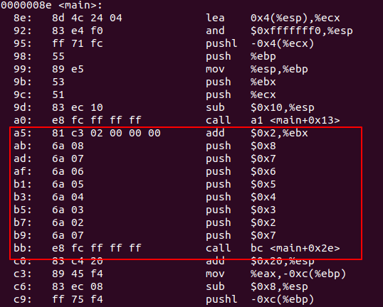

## Linux C 可变参数在x86和x64下的区别与实现原理

在x86平台下，va_list可变传参是通过栈来进行；在x64平台下，va_list可变传参是默认的调用约定。会带来什么影响呢？

<!--more-->

通过看对应的汇编代码实现和Intel ABI手册，可以得出：

- 在x86平台下，va_list可变传参是通过栈来进行；
- 在x64平台下，va_list可变传参是默认的调用约定（calling convention）；

## 一、从汇编代码分析

```c
#include <stdio.h>
#include <stdarg.h>

long add(long num, ...)
{
    long sum = 0, i, tmp;
    va_list va;

    va_start(va, num);
    for (i = 0; i < num; i++) {
        tmp = va_arg(va, int);
        sum += tmp;
        printf("%ld ", tmp);
    }
    printf("\n");
    va_end(va);
    
    return sum;
}

int main()
{
    long sum = add(7, 2, 3, 4, 5, 6, 7, 8);
    printf("sum is %ld\n", sum);
    return 0;
}
```

结果： **在64位和32位下输出结果一样**。

首先看一下32位编译情况，

```shell
gcc -m32 -c test.c
objdump -d test.o
```

结果如下：



然后看一下64位编译情况，

```shell
gcc -c test.c
objdump -d test.o
```

结果如下：


## 二、官方说明

在32位上，va_list的定义为:

```c
//注意，由于中间宏过多，这里省去了中间如_VA_LIST宏，直接给出实际定义。
typedef va_list char**;
```

在64位下，va_list的定义为:

``` c
 typedef struct {
         unsigned int gp_offset;
         unsigned int fp_offset;
         void *overflow_arg_area;
         void *reg_save_area;
} va_list[1];
```

然后再看一下[Inter官方的Linux ABI文档](https://software.intel.com/sites/default/files/article/402129/mpx-linux64-abi.pdf)（64位）怎么说，问题在abi中已经解释的很清楚了。

> ### The va_start Macro
>The va_start macro initializes the structure as follows:
>
> - **reg_save_area** The element points to the start of the register save area.
>
> - **overflow_arg_area** This pointer is used to fetch arguments passed on the stack. It is initialized with the address of the first argument passed on the stack, if any, and then always updated to point to the start of the next argument on the stack.
>
> - **gp_offset** The element holds the offset in bytes from reg_save_area to the place where the next available general purpose >argument register is saved. In case all argument registers have been exhausted, it is set to the value 48 (6 ∗ 8).
>
> - **fp_offset** The element holds the offset in bytes from reg_save_area to the place where the next available floating point >argument register is saved. In case all argument registers have been exhausted, it is set to the value 304 (6 ∗ 8 + 16 ∗ 16).

## 三、再看一下什么情况下可能出错

```c
#include <stdio.h>
#include <stdarg.h>

long add(long num, ...)
{
    long sum = 0, i, tmp;
    long *arg = &num + 1;

    for (i = 0; i < num; i++)
    {
        tmp = arg[i];
        sum += tmp;
        printf("%ld ", tmp);
    }
    printf("\n");
    return sum;
}

int main()
{
    long sum = add(7, 2, 3, 4, 5, 6, 7, 8);
    printf("sum is %ld\n", sum);
    return 0;
}
```

64位下结果为随机

```shell
0 1 140733246434352 140733246434352 0 2 3
sum is 281466492868710
```

32位下结果正确

```shell
2 3 4 5 6 7 8
sum is 35
```