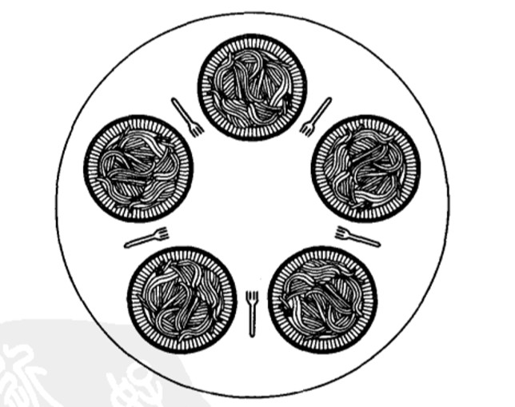

# 经典IPC问题 - 哲学家进餐问题

在1965年，Dijkstra提出并解决了一个他称之为**哲学家进餐**的同步问题。从那时起，每个发明新的同步原语的人都希望通过解决哲学家进餐问题来展示其同步原语的精妙之处。


哲学家进餐问题对于**多个竞争进程互斥地访问有限资源（如VO设备）**这一类问题的建模十分有用。这个问题可以简单地描述如下：五个哲学家围坐在一张圆桌周围，每个哲学家的前面都有一碟通心面，由于面条很滑，所以要两把叉子才能夹住，相邻两个碟子之间有一把叉子。



哲学家的生活包括两种活动，即吃饭和思考。当一个哲学家觉得饿时，他就试图分两次去取他左边和右边的叉子，每次拿一把，但不分次序。如果成功地获得了两把叉子，他就开始吃饭，吃完以后放下叉子继续思考。

这里的问题就是：为每一个哲学家写一段程序来描述其行为，要求不能死锁。

- **方案一（死锁）**：过程`take_fork`将一直等到所指定的叉子可用，然后将其取用。遗憾的是，这种解法是错误的。设想所有五个哲学家都同时拿起左面的叉子，则他们都拿不到右面的叉子，于是发生**死锁**。
    ```c
    #define N   5               /* 哲学家数目 */
    void philosopher(int i) {   /* i：哲学家号码，从0到4 */   
        while(TRUE)
        {
            think();            /* 哲学家正在思考 */
            take_fork(i);       /* 取左叉 */
            take_fork((i+1)%N); /* 取右叉；%为取余 */
            eat();              /* 吃面*/
            put_fork(i);        /* 放回左叉 */
            put_fork((i+1)%N);  /* 放回右叉 */
        }
    }
    ```

- **方案二（饥饿）**：规定在拿到左叉后，查看右面的叉子是否可用。如果不可用，则先放下左叉，等一段时间后再重复整个过程。可能在某一个瞬间，所有的哲学家都同时启动这个算法，拿起左叉，看到右叉不可用，又都放下左叉等一会儿，又同时拿起左叉，如此这样永远重复下去：所有的程序都在运行，但却无法取得进展这种情况就称为**饥饿（starvation）**。

- **方案三（不可靠）**：如果哲学家**在拿不到右叉时等待一段随机的时间，而不是等待相同的时间，则长时间处于上述死锁状态的机会就很小了**。这种想法是对的，而且在大多数应用中，稍后试的方法也不成问题。例如，在使用以太网的局域网时，检测到数据包碰撞，每台电脑等待一段随机的时间后重试。

- **方案四（效率低）**：使用一个二进制信号量对think函数之后的五条语句进行保护。在哲学家开始拿叉子之前，先对信号量mutex执行down操作。放回叉子后，再对mutex执行up操作。从理论上讲，这种解法是可行的。但从实际角度看，**同一时刻只能有一个哲学家进餐**。而五把叉子实际允许两个哲学家时进餐。

- **方案五**：下面的解法不仅正确，而且能获得最大的并行度。其中**使用一个数组`state`来跟踪一个哲学家是在吃饭、思考还是正在试图拿叉子：一个哲学家只有在两个邻居都不在进餐时才允许进入到进餐状态。**第i位哲学家的邻居由宏`LEFT`和`RIGHT`定义。

    哲学家进餐问题的解决方案使用了一个信号量数组，每个信号量分别对应一个哲学家，这样，当所需的叉子被占用时，想进餐的哲学家可以阻塞。注意，每个进程将过程`philosopher`作为主代码运行。
    ```c
    #define N           5               /* 哲学家数目 */
    #define LEFT        (i+N-1)%N       /* i的左邻号码 */
    #define RIGHT       (i+1)%N         /* i的右邻号码 */
    
    #define THINKING    0               /* 哲学家正在思考 */
    #define HUNGRY      1               /* 哲学家想取得叉子 */
    #define EATING      2               /* 哲学家正在吃面 */
    
    typedef int semaphore;
    int state[N];                       /* 记录每个人状态的数组 */
    semaphore mutex=1;                  /* 临界区互斥 */
    semaphore s[N];                     /* 每个哲学家一个信号量 */
    
    void philosopher(int i)             /* i：哲学家号码，从0到N-1 */
    {
        while(TRUE)
        {   
            think();                    /* 哲学家正在思考 */
            take_forks(i);              /* 需要两把叉子，或者阻塞 */
            eat();                      /* 进餐 */
            put_forks(i);               /* 把两把叉子同时放回桌子 */
        }
    }
    
    void take_forks(int i)              /* i：哲学家号码，从0到N-1 */
    {    
        down(&mutex);                   /* 进人临界区 */
        state[i]=HUNGRY;                /* 记录下哲学家i饥饿的事实 */
        test(i);                        /* 试图得到两把叉子 */
        down(&s[i]);                    /* 如果得不到叉子就阻塞 */
    }
    
    void put_forks(i)                   /* i：哲学家号码，从0到N-1 */
    {
        down(&mutex);                   /* 进人临界区 */
        state[i]=THINKING;              /* 哲学家进餐结束 */
        test(LEFT);                     /* 看一下左邻居现在是否能进餐 */
        test(RIGHT);                    /* 看一下右邻居现在是否能进餐 */
        up(&mutex);                     /* 离开临界区 */
    }
    
    void test(i)                        /* i：哲学家号码，从0到N-1 */
    {
        if(state[i]==HUNGRY && state[LEFT]!=EATING&&state[RIGHT]!=EATING){
            state[i]=EATING;
            up(&s[i]);
        }
    }
    ```